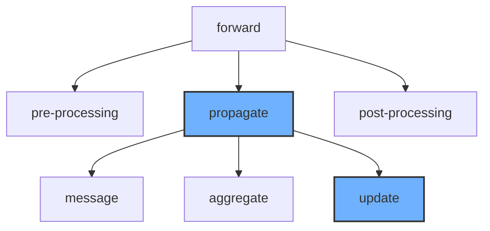

## Snapshot

Working through this part will help us become acutely familiar with the behind the scenes work of implementing pytorch Message Passing Layers, allowing us to build our own GNN models. To do so, we will work with and implement $3$ critical functions needed to define a PyG Message Passing Layer: `forward`, `message`, and `aggregate`.



The diagram illustrates the work flow of Message Passing Layer. The purple blocks need to be implemented while the blue blocks can inherit from class `MessagePassing` directly. 

The `forward` function that we will implement for our message passing layer captures this execution logic. Namely, the `forward` function handles the pre and post-processing of node features / embeddings, as well as initiates message passing by calling the `propagate` function.

The `propagate` function encapsulates the message passing process! It does so by calling three important functions: 1) `message`, 2) `aggregate`, and 3) `update`.

## Implementation

In this section, we will take Graph Attention Network(GAT) as a running example to get familiar with detailed implementation. 

Initialization: 

```python
class GAT(MessagePassing):

    def __init__(self, in_channels, out_channels, heads = 2,
                 negative_slope = 0.2, dropout = 0., **kwargs):
        super(GAT, self).__init__(node_dim=0, **kwargs)

        # multi-head attention 
        # the actual output channel is (out_channels * heads)
        self.in_channels = in_channels
        self.out_channels = out_channels
        self.heads = heads
        self.negative_slope = negative_slope
        self.dropout = dropout
        
        # Linear projection used for pre-processing
        self.lin_l = nn.Linear(in_channels, out_channels * heads)
        self.lin_r = self.lin_l
        # Attention mechanism a (a learnable vector)
        self.att_l = nn.Parameter(torch.zeros(heads, out_channels))
        self.att_r = nn.Parameter(torch.zeros(heads, out_channels))
        self.reset_parameters()

    def reset_parameters(self):
        nn.init.xavier_uniform_(self.lin_l.weight)
        nn.init.xavier_uniform_(self.lin_r.weight)
        nn.init.xavier_uniform_(self.att_l)
        nn.init.xavier_uniform_(self.att_r)
```

Forward Pass: 

```python
def forward(self, x, edge_index, size = None):
	H, C = self.heads, self.out_channels
	x_l = self.lin_l(x).reshape(-1, H, C) # (N, H ,C)
	x_r = self.lin_r(x).reshape(-1, H, C) # (N, H, C)
	# use dot product to compute attention score. 
	alpha_l = torch.sum(self.att_l * x_l, dim = -1) # (N, H)
	alpha_r = torch.sum(self.att_r * x_r, dim = -1) # (N, H)
	# call propagate
	# "propagate" can recieve extra information alpha (attention score)
	# and pass it to "message" method. 
	out = self.propagate(edge_index, x = (x_l, x_r), 
                             alpha = (alpha_l, alpha_r), size = size)
	# propagate receives 
	out = out.reshape(-1, H * C)
	return out
```

Message:

```python
def message(self, x_j, alpha_j, alpha_i, index, ptr, size_i):
	# x_j is the information from neighborhood
	# index specify which node the neighbor belongs to
	# alpha_j and alpha_i is the extra information (attention score)
	# the first dimension of all tensors is |E| (transformed by propagate)
	alpha = F.leaky_relu(alpha_i + alpha_j, negative_slope =
                             self.negative_slope) # (E, H)
	# Given a value tensor src, this function first groups the values
	# along the first dimension based on the indices specified in index,
	# and then proceeds to compute the softmax individually for each group
	att_weight = torch_geometric.utils.softmax(alpha, index, ptr, size_i)
    # (E, H)
	out = att_weight.unsqueeze(dim = -1) * x_j # (E, H, C)
	return out
```

Aggregate: 

```python
def aggregate(self, inputs, index, dim_size = None):
    # same as the softmax above 
    # first groups, then add up based on index 
	out = torch_scatter.scatter(inputs, index, self.node_dim, 
                                    dim_size = dim_size, reduce = "sum")
    # (N, H)
    return out 
```

